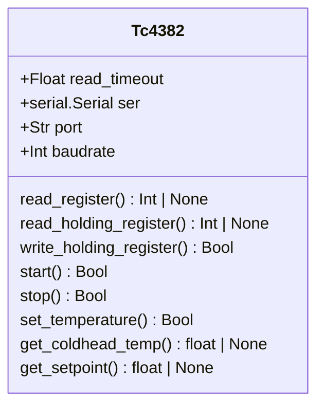

# tc4382.py

Low-level Python modules to send commands to Lihan TC4382 controllers.

## Currently Supported Models
- TC4382    - tc4382.py

## Features
- Connect to Lihan over USB
- Query sensor values
- Start, stop, modify and read setpoint

## Requirements

- Install base class from https://github.com/COO-Utilities/hardware_device_base

## Installation

```bash
pip install .
```

## Usage

```python
import tc4382

port = tc4382.find_port()
controller = tc4382.Tc4382()    # defaults to 336
controller.connect(port, 4800)  # USB port and baud rate

# start cryocooler
controller.start()

# stop cryocooler
controller.stop()

# Print coldhead temperature
print(controller.get_coldhead_temp())

# Print setpoint
print(controller.get_setpoint())

# For a comprehensive list of classes and methods, use the help function
help(tc4382)

```

## 🧪 Testing
Unit tests are located in `tests/` directory.

To run all tests from the project root:

```bash
python -m pytest
```

## Class Diagram

Below is a class diagram of the added methods and attributes for the lakeshore.
See the README for the hardware_device_base module for the inherited methods and
attributes.

